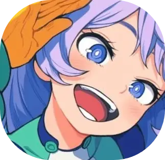
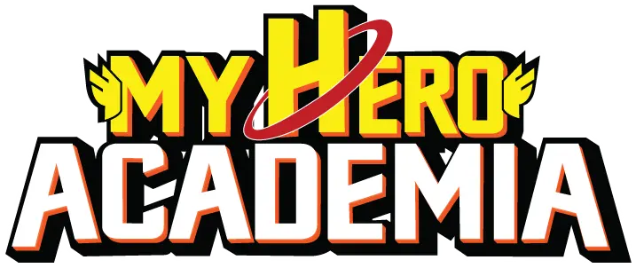

  

<h1 align="center">Random MHA Quirk</h1>

  <strong>Plus Ultra your luck.</strong> 
  Roll quirks from My Hero Academia universe — one fate at a time, or two powers forged into one.

  <a href="https://random-mha-quirk.vercel.app/"><strong>▶ Enter the site</strong></a>

  

---

## What is this?

**[Random MHA Quirk](https://random-mha-quirk.vercel.app/)** is a fan-made quirk roller for *My Hero Academia*. No account, no grind — tap **Start**, follow the path, and let the wheel decide what your next individuality looks like. Filter by type and tier if you want control; leave it wide open if you trust fate.

Available in **English**, **Português (Brasil)**, and **Español**.

---

## Quirks — your individuality, rolled

In *MHA*, a **Quirk** is the power you are born with. This site lets you roll one from a curated pool inspired by canon sources and original entries in the same style.

You can keep it random or narrow the pool by type, tier, and filters. Every result shows the essentials: name, description, type, range, facets, and tier.

The quirk catalog is stored in **Supabase** and loaded via API (`GET /api/quirks`) with server caching. Authoring files live under `tools/catalog/output/`; seed with `pnpm quirks:seed` after `pnpm db:push`.

---

## Hybrids — when two fates collide

Choose **Hybrid** to roll two parent quirks instead of one. You pick a type (or **Any**) for each side, and the app draws one quirk per side.

From that pair, the site generates a fusion concept inspired by both parent quirks. Parent cards stay visible so you can compare the originals with the fusion result.

---

## Try your luck

| Path | What happens |
|------|----------------|
| **One Quirk** | Shape the pool (type, tier, filters), then draw a single individuality. |
| **Hybrid** | Roll two parent quirks, then witness their fusion. |
| **Try Your Luck** | Let chance pick solo or hybrid for you. |

---

  <em>Fan project. Not affiliated with Kohei Horikoshi, Shueisha, or any official My Hero Academia release.</em>

